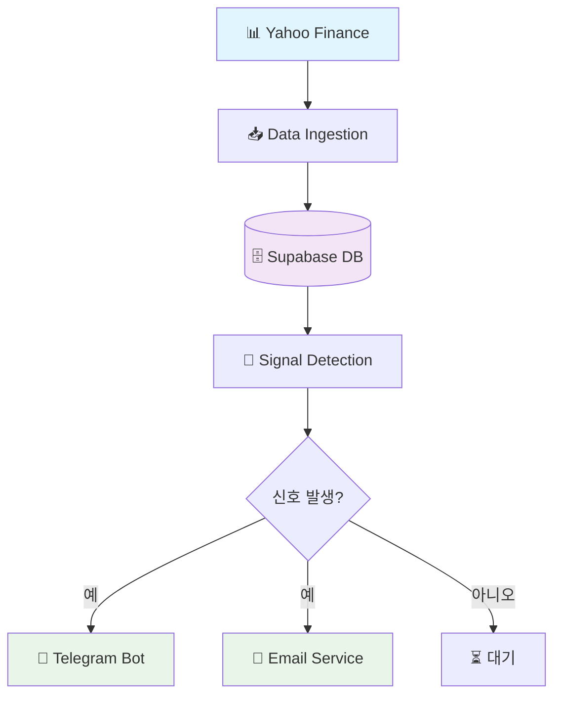
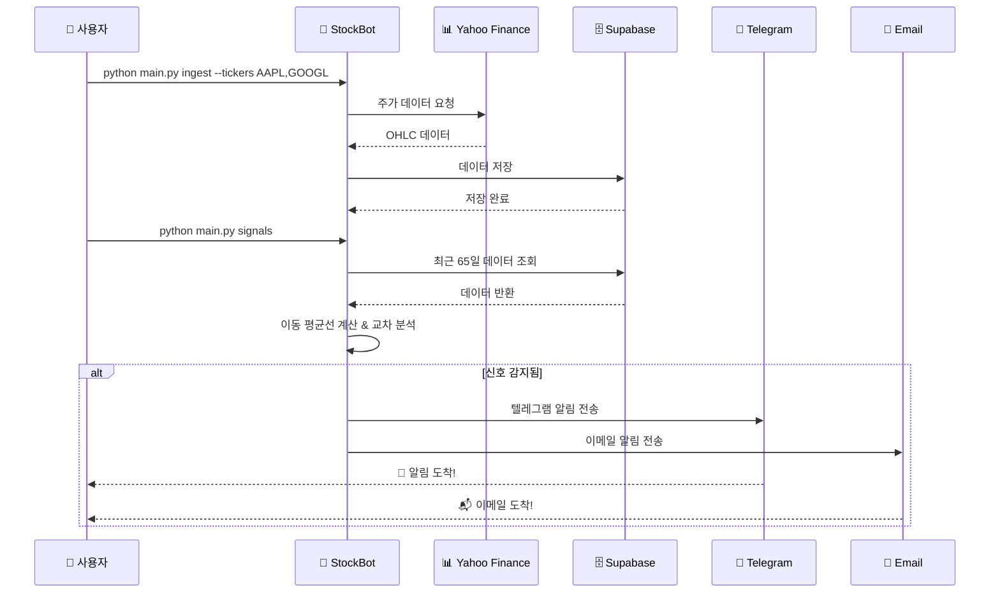
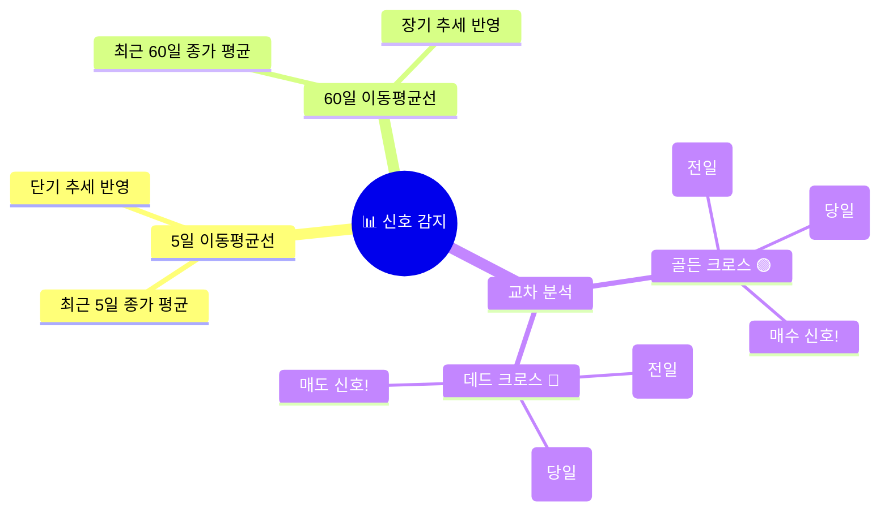

# 🚀📈 StockBot: 나스닥 이동 평균선 신호 알리미

<div align="center">


**나스닥 주식의 5일/60일 이동 평균선 교차를 감지하여 실시간으로 알려주는 스마트 알림 봇!** 💰📊

[📖 기능 소개](#-프로젝트-소개) • [⚡ 빠른 시작](#-빠른-시작) • [🔧 설치 및 설정](#-설치-및-설정) • [📋 사용법](#-사용법) • [🗂️ 데이터베이스 스키마](#️-데이터베이스-스키마)

</div>

---

## 🎯 프로젝트 소개

**StockBot**은 나스닥 주식들의 **5일 이동 평균선**과 **60일 이동 평균선**이 교차하는 순간을 감지하여, **텔레그램**과 **이메일**로 알림을 보내주는 프로그램입니다! 🤖💹

### ✨ 주요 특징

- 🟢 **골든 크로스 감지**: 5일선이 60일선 위로 올라갈 때 (매수 신호!)
- 🔴 **데드 크로스 감지**: 5일선이 60일선 아래로 떨어질 때 (매도 신호!)
- 📡 **실시간 알림**: 텔레그램 봇 + 이메일로 알림
- 🗄️ **Supabase 연동**: 데이터 저장
- 📊 **Yahoo Finance 연동**: 주가 데이터 수집
- 🧪 **테스트 모드**: `--dry-run`으로 실제 알림 없이 테스트 가능

### 🏗️ 아키텍처 개요



---

## 🔄 시스템 플로우



---

## ⚡ 빠른 시작

> 🚀 **아래의 설정을 참고하세요**

### 1️⃣ 환경 준비
```bash
# Python 3.12+ 확인
python --version

# 의존성 설치
pip install -r requirements.txt
# 또는 uv를 사용한다면:
uv sync
```

### 2️⃣ Supabase 설정
```bash
# 새로운 Supabase 프로젝트 생성
# https://supabase.com 에서 무료 계정 만들기

# 데이터베이스 스키마 생성
python scripts/supabase_smoke_test.py --apply-schema
```

### 3️⃣ 환경변수 설정
```bash
# .env 파일 생성
cp .env.example .env

# 필수 값들 입력 (아래에서 자세히 설명)
nano .env
```

### 4️⃣ 첫 실행!
```bash
# 데이터 수집 (예: 애플, 구글, 마이크로소프트)
python main.py ingest --tickers AAPL,GOOGL,MSFT

# 신호 감지 및 알림
python main.py signals
```

---

## 🔧 설치 및 설정

### 📋 요구사항

- **Python**: 3.12 이상 🐍
- **Supabase**: 무료 계정 (데이터베이스 + API)
- **Yahoo Finance**: 무료 API (yfinance 라이브러리)
- **Telegram Bot**: 선택사항 (알림용)
- **SMTP 서버**: 선택사항 (이메일 알림용)

### 📦 의존성 설치

**방법 1: pip 사용**
```bash
pip install pandas python-dotenv requests supabase yfinance
```

**방법 2: uv 사용 (권장)**
```bash
# uv 설치 (한 번만)
curl -LsSf https://astral.sh/uv/install.sh | sh

# 의존성 설치
uv sync
```

### ⚙️ 환경변수 설정

프로젝트 루트에 `.env` 파일을 생성하고 다음 값들을 설정하세요:

#### 필수 설정 🔴
```env
# Supabase 설정 (https://supabase.com 에서 프로젝트 생성)
SUPABASE_URL=https://your-project-id.supabase.co
SUPABASE_SERVICE_ROLE_KEY=your-service-role-key-here
# 또는 익명 키 사용 (읽기 전용)
SUPABASE_ANON_KEY=your-anon-key-here

# 기본 티커 목록 (선택사항)
TICKERS=AAPL,GOOGL,MSFT,AMZN,NFLX
```

#### 텔레그램 알림 설정 (선택사항) 📱
```env
# Telegram Bot Token 획득 방법:
# 1. @BotFather 에게 /newbot 명령어 전송
# 2. 봇 이름과 사용자명 입력
# 3. 생성된 토큰 복사
TELEGRAM_BOT_TOKEN=1234567890:ABCdefGHIjklMNOpqrsTUVwxyz

# Chat ID 획득 방법:
# 1. 생성한 봇에게 메시지 전송
# 2. https://api.telegram.org/bot<TOKEN>/getUpdates 방문
# 3. "chat": {"id": 123456789} 에서 ID 추출
TELEGRAM_CHAT_ID=123456789
```

#### 이메일 알림 설정 (선택사항) 📧
```env
# Gmail 사용 예시
SMTP_HOST=smtp.gmail.com
SMTP_PORT=587
SMTP_USER=your-email@gmail.com
SMTP_PASS=your-app-password
EMAIL_FROM=your-email@gmail.com
EMAIL_TO=recipient@example.com
```

> 📝 **주의**: Gmail을 사용할 경우 "앱 비밀번호"를 생성해서 사용하세요!

### 🗄️ 데이터베이스 스키마

Supabase 대시보드의 SQL Editor에서 다음 쿼리를 실행하세요:

```sql
-- 메타: 티커 목록
create table if not exists public.tickers (
  ticker   text primary key,
  name     text,
  exchange text default 'NASDAQ'
);

-- 일봉 OHLC (티커 통합)
create table if not exists public.ohlc_daily (
  ticker text references public.tickers(ticker) on delete cascade,
  d      date not null,
  open   double precision,
  high   double precision,
  low    double precision,
  close  double precision not null,
  volume bigint,
  primary key (ticker, d)
);

-- 조회 최적화 인덱스(최근 N일 + 티커)
create index if not exists idx_ohlc_daily_ticker_date_desc
  on public.ohlc_daily (ticker, d desc);

-- 교차 신호 로그 (중복 방지)
create table if not exists public.signals (
  id          bigserial primary key,
  ticker      text not null references public.tickers(ticker) on delete cascade,
  d           date not null,
  signal_type text not null check (signal_type in ('golden_cross','dead_cross')),
  price       double precision not null,
  sma5        double precision not null,
  sma60       double precision not null,
  created_at  timestamptz not null default now(),
  unique (ticker, d, signal_type)
);

-- RLS 켜기(여러 번 실행해도 무해)
alter table public.tickers     enable row level security;
alter table public.ohlc_daily  enable row level security;
alter table public.signals     enable row level security;

-- 읽기 전용 공개(anon, authenticated 모두)
create policy tickers_read
  on public.tickers for select using (true);

create policy ohlc_read
  on public.ohlc_daily for select using (true);

create policy signals_read
  on public.signals for select using (true);
```

---

## 📋 사용법

### 🎯 기본 명령어

#### 1. 데이터 수집 (Ingestion) 📥
```bash
# 기본 티커들로 데이터 수집
python main.py ingest

# 특정 티커들만 수집
python main.py ingest --tickers AAPL,GOOGL,MSFT,AMZN

# Netflix, Tesla, Meta 수집
python main.py ingest --tickers NFLX,TSLA,META
```

#### 2. 신호 감지 및 알림 (Signals) 🚨
```bash
# 모든 티커에 대해 신호 감지
python main.py signals

# 특정 티커들만 감지
python main.py signals --tickers AAPL,GOOGL

# 테스트 모드 (알림 보내지 않음)
python main.py signals --dry-run
```

### 🔍 신호 감지 로직

StockBot은 다음과 같은 알고리즘으로 신호를 감지합니다:



### 📱 알림 예시

#### 텔레그램 알림
```
🟢 <b>AAPL</b> 2024-01-15 — Golden Cross
Close: 185.92 / SMA5: 182.45 / SMA60: 178.23
```

#### 이메일 알림
```
Subject: [AAPL] GOLDEN_CROSS on 2024-01-15

AAPL Golden Cross
Date   : 2024-01-15
Close  : 185.92
SMA5   : 182.45
SMA60  : 178.23
```

---

## 🧪 테스트 및 검증

### Supabase 연결 테스트
```bash
# 기본 테스트
python scripts/supabase_smoke_test.py

# 스키마 적용 후 테스트
python scripts/supabase_smoke_test.py --apply-schema

# 익명 키로 테스트
python scripts/supabase_smoke_test.py --use-anon

# 테스트 데이터 정리
python scripts/supabase_smoke_test.py --cleanup
```

### 데이터 검증
```bash
# 특정 티커의 최근 데이터 확인
python -c "
from stockbot.config import Config
from stockbot.db import SupaDB
conf = Config.from_env()
db = SupaDB(conf.supabase_url, conf.supabase_service_role_key)
rows = db.fetch_last_n('AAPL', 5)
for row in rows:
    print(f'{row.d}: {row.close}')
"
```

---

## 🏗️ 프로젝트 구조

```
cloud_run_proj/
├── 📄 main.py                 # CLI 인터페이스 🚀
├── 📄 pyproject.toml          # 프로젝트 설정 ⚙️
├── 📄 schema.sql              # 데이터베이스 스키마 🗄️
├── 📁 stockbot/               # 메인 모듈 🤖
│   ├── 📄 __init__.py
│   ├── 📄 config.py           # 환경변수 설정 🔧
│   ├── 📄 db.py               # Supabase 연동 🗄️
│   ├── 📄 indicators.py       # 기술적 지표 계산 📊
│   ├── 📄 ingest.py           # 데이터 수집 📥
│   ├── 📄 notifiers.py        # 알림 기능 📱📧
│   ├── 📄 signals.py          # 신호 감지 및 알림 🚨
│   └── 📄 yf_client.py        # Yahoo Finance 클라이언트 📊
└── 📁 scripts/                # 유틸리티 스크립트 🛠️
    └── 📄 supabase_smoke_test.py  # 연결 테스트 ✅
```

### 🧩 모듈별 역할

| 모듈 | 역할 | 이모지 |
|------|------|--------|
| `config.py` | 환경변수 로드 및 설정 | 🔧 |
| `db.py` | Supabase 데이터베이스 연동 | 🗄️ |
| `indicators.py` | 이동 평균선 계산 및 교차 감지 | 📊 |
| `ingest.py` | Yahoo Finance에서 데이터 수집 | 📥 |
| `signals.py` | 신호 감지 및 알림 발송 | 🚨 |
| `notifiers.py` | 텔레그램/이메일 알림 | 📱📧 |
| `yf_client.py` | Yahoo Finance API 래퍼 | 📊 |

---

## 🚀 고급 사용법

### 🔄 자동화 스크립트

**크론탭으로 매일 실행:**
```bash
# 매일 오전 9시 데이터 수집, 오후 4시 신호 감지
crontab -e

# 추가할 내용:
0 9 * * 1-5 /path/to/python /path/to/main.py ingest
0 16 * * 1-5 /path/to/python /path/to/main.py signals
```

### 📊 커스텀 티커 관리

```python
# config.py에서 기본 티커 변경
TICKERS=AAPL,GOOGL,MSFT,AMZN,NFLX,TSLA,META,NVDA

# 또는 실행 시 지정
python main.py ingest --tickers YOUR,CUSTOM,TICKERS
```

### 🔍 데이터 분석

Supabase 대시보드에서 SQL로 데이터 분석:

```sql
-- 최근 신호 확인
SELECT ticker, d, signal_type, price, sma5, sma60
FROM signals
ORDER BY created_at DESC
LIMIT 10;

-- 티커별 데이터 건수
SELECT ticker, COUNT(*) as data_points
FROM ohlc_daily
GROUP BY ticker
ORDER BY data_points DESC;
```

---

## ❓ FAQ

### Q: Supabase 키는 어디서 얻나요?
A: [supabase.com](https://supabase.com)에서 무료 계정 생성 → 프로젝트 생성 → Settings → API 에서 확인 가능합니다.

### Q: 텔레그램 봇은 어떻게 만들나요?
A: Telegram에서 @BotFather 검색 → `/newbot` 명령어 → 봇 이름과 사용자명 입력 → 토큰 받기

### Q: 이메일 알림이 작동하지 않아요
A: Gmail의 경우 "앱 비밀번호"를 생성해서 사용하세요. Google 계정 설정 → 보안 → 2단계 인증 → 앱 비밀번호

### Q: 데이터가 부족하면 어떻게 되나요?
A: 60일 데이터가 필요합니다. 신규 티커는 최소 60일간 데이터가 쌓일 때까지 신호를 감지하지 않습니다.

### Q: Cloud Run에 배포하고 싶어요
A: `cloud_run_proj` 이름에서 알 수 있듯이 Google Cloud Run에 최적화되어 있습니다! 🚀

---


## 📄 라이선스

MIT License - 자유롭게 사용하세요! 🎉

---

<div align="center">

**⭐ 이 프로젝트가 도움이 되셨나요? Star를 눌러주세요!**

**질문 있으시면 언제든 연락주세요! 💬**

*Happy Trading with StockBot!* 🚀📈💰

</div>
