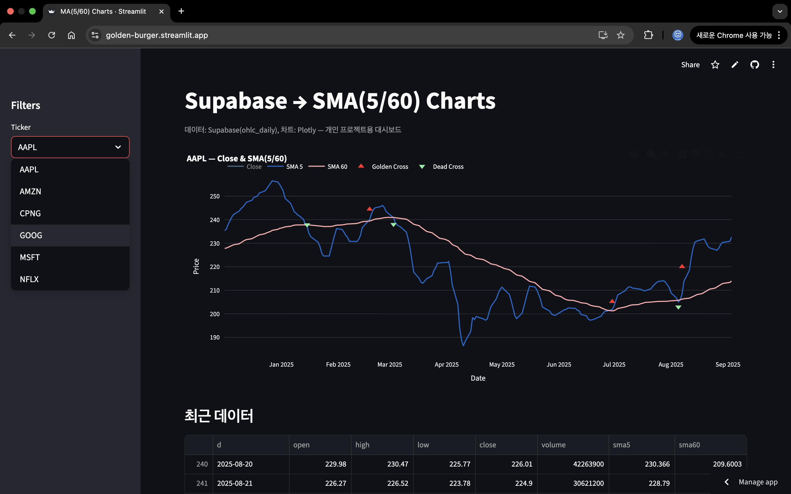
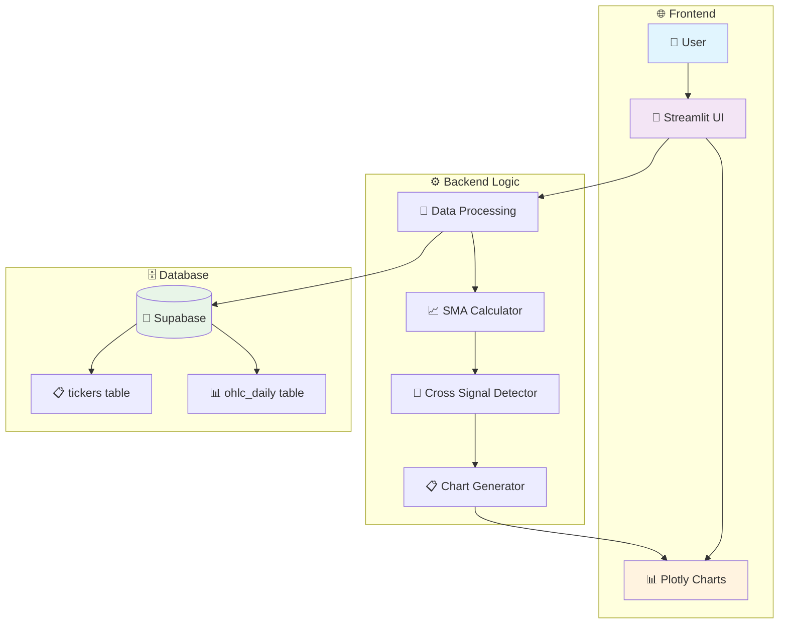
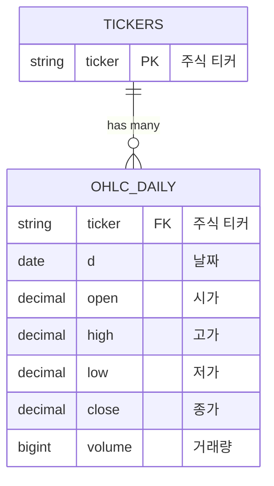
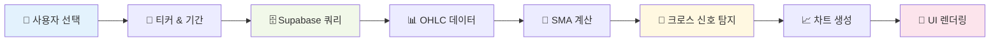
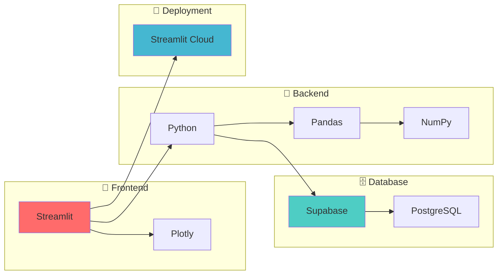

# 📈 Golden Burger - Stock Chart Dashboard

> 🚀 **Live Demo**: [https://golden-burger.streamlit.app/](https://golden-burger.streamlit.app/)

## 🌟 프로젝트 소개

Golden Burger는 Supabase와 Streamlit을 활용한 **실시간 주식 차트 대시보드**입니다! 📊  
5일/60일 이동평균선을 통해 **골든크로스** 🌟와 **데드크로스** ⚡ 신호를 한눈에 확인할 수 있습니다.

### ✨ 주요 기능

- 📈 **실시간 주식 차트**: 인터랙티브 Plotly 차트
- 🎯 **골든크로스/데드크로스**: 매매 신호 자동 탐지
- 🔄 **실시간 데이터**: Supabase 연동으로 최신 데이터 제공
- 📱 **반응형 디자인**: 모바일/데스크톱 최적화
- ⚡ **고성능 캐싱**: 5분 TTL로 빠른 응답

## 🖼️ 사이트 미리보기


*실제 대시보드 화면 - 골든크로스와 데드크로스 신호가 표시된 차트*

## 🏗️ 아키텍처



## 🚀 빠른 시작

### 📋 사전 요구사항

- 🐍 Python 3.12+
- 🔧 UV (패키지 매니저)
- 🗄️ Supabase 계정

### 🛠️ 설치 및 실행

1. **📦 저장소 클론**
   ```bash
   git clone <repository-url>
   cd streamlit_proj
   ```

2. **🔧 의존성 설치**
   ```bash
   uv install
   ```

3. **⚙️ 환경 설정**
   
   `.streamlit/secrets.toml` 파일을 생성하고 다음 내용을 추가:
   ```toml
   SUPABASE_URL="__SUPABASE_URL__"
   SUPABASE_ANON_KEY="__SUPABASE_ANON_KEY__"
   ```

4. **🚀 애플리케이션 실행**
   ```bash
   streamlit run app.py
   ```

## 🐍 PyCharm에서 실행하기

### Run Configuration 설정

```yaml
📝 Configuration Name: Streamlit App
🔧 Module: streamlit.web.cli
⚙️ Parameters: run /절대경로/app.py --server.port=8501 --logger.level=debug
📁 Working directory: 프로젝트 루트
🌍 Environment variables: 
   - SUPABASE_URL: your_supabase_url
   - SUPABASE_ANON_KEY: your_supabase_anon_key
```

### 🔧 상세 설정 가이드

1. **Run/Debug Configurations** 열기 (`Ctrl+Alt+Shift+F10`)
2. **➕ Add New Configuration** → **Python**
3. 다음 정보 입력:
   - **Module name**: `streamlit.web.cli` ✅
   - **Parameters**: `run /절대경로/app.py --server.port=8501 --logger.level=debug` ⚙️
   - **Working directory**: 프로젝트 루트 경로 📁
   - **Environment variables**: `SUPABASE_URL`, `SUPABASE_ANON_KEY` 🔑

## 📊 데이터베이스 스키마



## 🔄 데이터 플로우



## 🎯 핵심 기능 설명

### 📈 이동평균선 (Simple Moving Average)

- **SMA5**: 5일 단순 이동평균 🟢
- **SMA60**: 60일 단순 이동평균 🔵

### 🎯 매매 신호

| 신호 | 조건 | 표시 | 의미 |
|------|------|------|------|
| 🌟 골든크로스 | SMA5 > SMA60 (상향돌파) | 🔺 | 매수 신호 |
| ⚡ 데드크로스 | SMA5 < SMA60 (하향돌파) | 🔻 | 매도 신호 |

## 🛠️ 기술 스택



## 📁 프로젝트 구조

```
streamlit_proj/
├── 📊 app.py                    # 메인 애플리케이션
├── 📋 pyproject.toml           # 프로젝트 설정
├── 🔒 uv.lock                  # 의존성 잠금 파일
├── 📝 README.md                # 프로젝트 문서
├── 📖 CLAUDE.md                # Claude 개발 가이드
├── 🇰🇷 개발가이드.md             # 한국어 개발 가이드
├── 🖼️ images/                  # 이미지 파일들
│   └── dashboard-preview.png   # 대시보드 미리보기
├── .streamlit/                 # Streamlit 설정
│   └── 🔑 secrets.toml         # 환경 변수 (git 제외)
└── .venv/                      # 가상 환경
```

## 🔧 환경 변수

| 변수명 | 설명 | 필수 여부 |
|--------|------|-----------|
| `SUPABASE_URL` | Supabase 프로젝트 URL | ✅ 필수 |
| `SUPABASE_ANON_KEY` | Supabase Anonymous Key | ✅ 필수 |

## 📈 성능 최적화

- **🔄 캐싱**: Streamlit의 `@st.cache_data`로 5분 TTL 적용
- **📊 데이터**: 필요한 컬럼만 선택적 로드
- **🎨 UI**: `use_container_width=True`로 반응형 차트
- **⚡ 연결**: Supabase 클라이언트 재사용

## 🐛 트러블슈팅

### 자주 발생하는 문제들

1. **🔑 인증 오류**
   ```
   해결: .streamlit/secrets.toml 파일의 키 값 확인
   ```

2. **📊 데이터 없음**
   ```
   해결: Supabase 테이블에 데이터가 있는지 확인
   ```

3. **🚀 배포 실패**
   ```
   해결: Streamlit Cloud의 Secrets 설정 확인
   ```

## 🤝 기여하기

1. 🍴 Fork the Project
2. 🔧 Create your Feature Branch (`git checkout -b feature/AmazingFeature`)
3. 💾 Commit your Changes (`git commit -m 'Add some AmazingFeature'`)
4. 📤 Push to the Branch (`git push origin feature/AmazingFeature`)
5. 🔀 Open a Pull Request

## 📄 라이센스

이 프로젝트는 MIT 라이센스를 따릅니다. 자세한 내용은 `LICENSE` 파일을 참조하세요.

## 🙋‍♂️ 문의하기

프로젝트에 대한 질문이나 제안사항이 있으시면 이슈를 생성해 주세요! 🎉

---

<div align="center">

**⭐ 이 프로젝트가 도움이 되었다면 별점을 눌러주세요! ⭐**

Made with ❤️ and lots of ☕

</div>